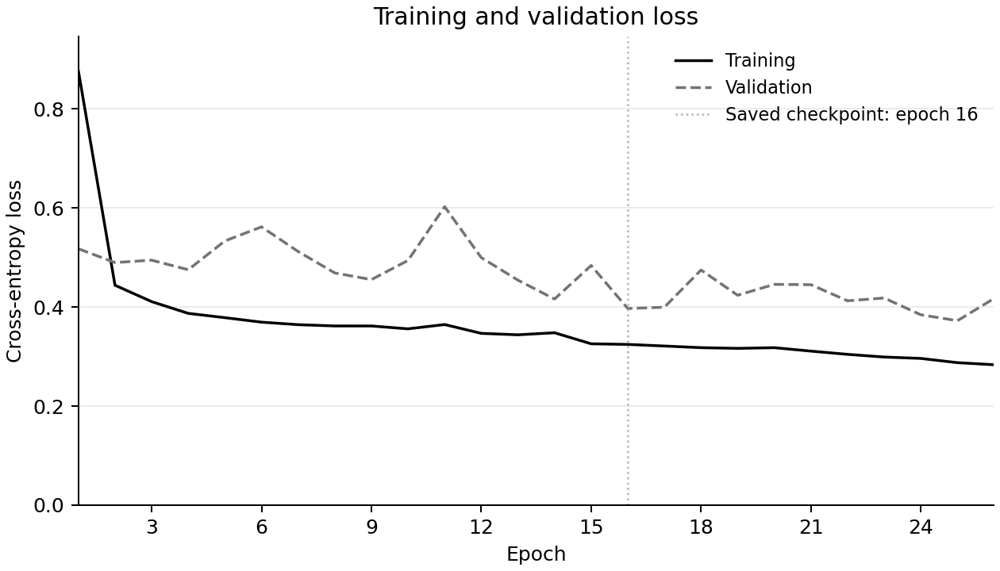

# TernaryGuard

TernaryGuard is an IoT botnet classifier trained in PyTorch and implemented in C and Arduino Nano firmware. It uses weights restricted to −1, 0 and +1 to reduce storage and simplify the dot product.

The model has a 1,696-byte parameter payload and reaches 81.08% test accuracy. The C engine matches Python on all 69,040 test rows. The physical Nano was checked on 5,855 unique rows. These are different checks; matching Python does not mean every classification is correct.

The software and Nano research prototype is complete. FPGA acceleration is [future work](future-scope/README.md).

## What it does, in plain language

Internet-connected devices such as cameras and doorbells can be compromised and used together in a **botnet**. Their network activity can leave patterns in traffic measurements. A classifier learns to associate those patterns with normal activity or a known attack type.

TernaryGuard receives **numerical traffic statistics**, prepares 20 selected measurements, and predicts one of 11 categories: normal traffic or one of ten botnet attack classes.

The Nano has only **2 KB of SRAM** for working memory. The engineering challenge is to fit the model's runtime buffers and firmware into that environment, then check that the embedded implementation behaves like the original Python model.

The weights live in flash memory; the working buffers use SRAM. This distinction matters: a small weight file alone does not prove that a program fits on a microcontroller.

This prototype takes already extracted dataset statistics. It does not capture packets, calculate live network features, or block traffic.

## Why ternary weights?

A typical neural network uses weights that can take many decimal values. This model restricts each weight to **−1, 0 or +1**. Those three choices simplify the dot product:

- **+1:** add the input.
- **0:** skip it.
- **−1:** subtract the input.

For example:

```text
Inputs:   [ 4, 2,  5, 3 ]
Weights:  [ 1, 0, -1, 1 ]
Sum:        4 + 0 - 5 + 3 = 2
```

This is a small integer example of the operation, not a captured model input.

The weights are packed into **two bits each**. The C and AVR engines convert activations to bounded integers before the dot product, so the inner accumulation loop uses integer add/subtract/skip operations.

That does **not** make the whole network integer-only or multiplication-free. Input preprocessing, normalization and final scaling still use floating point.

## Results and the tradeoff

The model is much smaller than its FP32 baseline, but its classification accuracy is lower. Both sides of that tradeoff matter. FP32 is the conventional 32-bit floating-point model; the INT8 comparison simulates weights restricted to 8-bit values.

| Model | Parameter storage | Test accuracy |
|---|---:|---:|
| FP32 baseline | 15,484 bytes | 89.60% |
| INT8 weight simulation | 4,456 bytes | 88.75% |
| Ternary | 1,696 bytes | 81.08% |

The table uses only the [final run](results.csv), with the same **20 → 64 → 32 → 11** architecture. Storage is the accounted model-parameter payload, excluding firmware and runtime RAM. INT8 here is **weight-quantization simulation with FP32 execution**, not an integer runtime benchmark.

**Known weakness: BASHLITE TCP recall is 1/5,555 (0.018%).** The model recognizes only one of those attack examples as that specific class. The same example, at frozen test index **59782**, is detected by Python, C and the Nano. This weakness prevents a claim of reliable recognition of all 11 classes. It does not by itself mean every missed TCP example was classified as normal traffic.

### Recorded training curve



This graph is plotted directly from the 26 epoch records in [the final training log](docs/benchmarks/phase3_final_seed42/ternary_2bit.json). The solid line is training loss; the dashed line is validation loss. Loss measures prediction error during training, so lower is better. The vertical line marks the saved checkpoint at epoch 16. Checkpoint selection used validation macro-F1 and per-class recall checks, rather than choosing the lowest validation loss shown here.

Training used devices 1–7; validation used device 8. Device 9 was reserved for testing. This is the recorded run, not a new experiment. To regenerate the plot:

```sh
python3 scripts/render_readme_assets.py
```

### What was actually checked?

| Check | Result | Scope |
|---|---:|---|
| Model accuracy / macro-F1 | **81.08% / 0.7821** | 69,040 test rows from held-out device 9 |
| C predictions against PyTorch | **Zero disagreements** | All 69,040 frozen test rows |
| Physical Nano predictions against PyTorch | **Zero disagreements** | 5,855 unique frozen test rows |
| Workstation median inference | **3.763 μs** | Apple M3; warm cache; preprocessing included; I/O excluded |
| Nano median inference | **36.308 ms** | Physical `micros()` readings on 330 stratified rows; preprocessing included; UART excluded |
| Nano application flash | **8,076 bytes** | `avr-size`, followed by flash readback verification |
| Nano static SRAM | **1,212 bytes** | `.data + .bss` from `avr-size` |
| Nano observed SRAM high-water mark | **1,321 bytes** | Approximate canary measurement; 727-byte untouched gap |

The physical test covered **330 stratified rows** (30 per class) and **all 5,555 BASHLITE TCP rows**. Thirty rows overlap between the passes: **5,885 transactions, 5,855 unique rows**. The entire 69,040-row test set has not been run on the Nano.

### Accuracy and implementation agreement are different

**Accuracy** asks whether the model predicted the correct dataset label. **Implementation agreement** asks whether C or the Nano predicted the same class as Python.

For example, if Python mislabels a TCP attack and the Nano returns the same wrong class, the port agrees with Python—but the model still made a classification error. Agreement proves that the port preserves the reference's behavior; it does not repair the model's weaknesses.

The workstation and Nano timings also describe different processors and test setups. They are separate measurements, not a controlled speedup comparison.

## Try it without a board

You can build the C engine and replay bundled vectors without downloading the dataset or connecting an Arduino.

Requires **Python 3.11+** and a C compiler available as `cc`. Use macOS, Linux or WSL for the build and compilation tests.

```sh
git clone https://github.com/AryanAI0035/TernaryGuard.git
cd TernaryGuard

python3 -m venv .venv
source .venv/bin/activate
python3 -m pip install -r requirements.txt

python3 scripts/demo.py
```

The demo checks the existing model artifacts, compiles the C engine, and compares its output with PyTorch and the exported-header reader on **264 bundled preprocessed engineering vectors**. Look for `"samples": 264` and zero `prediction_disagreements` in each comparison.

This is an engineering replay, not a fresh dataset-accuracy evaluation or a live traffic demo. Because its inputs are already preprocessed, it does not test the raw-data preprocessing path.

Run the **99 core regression tests**:

```sh
python3 -m pytest model/tests/ -v --tb=short
```

For the full dataset check, C benchmarking, or Nano flashing and serial validation, follow [the reproduction guide](docs/reproduce.md). The small frozen checkpoint and split identities are included in Git; the raw dataset and other training checkpoints are excluded.

## Technical details

<details>
<summary><strong>Architecture, data split and numerical implementation</strong></summary>

### Network

**20 → 64 → 32 → 11** means 20 input features, two hidden layers with 64 and 32 units, and 11 output scores. The hidden layers apply RMSNorm before the ternary linear operation and ReLU afterward. The output layer has neither RMSNorm nor ReLU. The class with the largest score is selected.

```text
115 raw statistics
  → 20 selected features
  → signed-log1p + StandardScaler
  → RMSNorm → ternary 20×64 → ReLU
  → RMSNorm → ternary 64×32 → ReLU
  → ternary 32×11 → 11 scores → class
```

### Evaluation protocol

| Partition | Devices | Rows |
|---|---|---:|
| Training | 1–7 | 411,915 |
| Validation | 8 | 69,045 |
| Test | 9 | 69,040 |

Feature selection, redundancy filtering and scaler fitting use training rows only. Model selection uses validation metrics. The test device stays separate. See [the corrected methodology](docs/phase3_corrections.md).

### Packed parameters

The network has **3,680 ternary weights**, packed into **920 bytes**. Float32 biases, layer scales and RMSNorm gamma bring the parameter payload to **1,696 bytes**, compared with **15,484 bytes** for FP32—about **9.13× smaller**. Exported constants including dimensions and epsilon metadata total **1,712 bytes**.

Encoding is LSB-first: `00 = 0`, `01 = +1`, `10 = −1`. Reserved code `11` is rejected. The engines read the exact root [model_weights.h](model_weights.h); builds verify its identity against the active manifest.

### C and AVR arithmetic

The engines use a shared power-of-two exponent to convert activations into bounded int64 values. Packed dot products then accumulate by add/subtract/skip. The exponent is restored and trained scale/bias applied after the integer sum. No dynamic allocation occurs in the inference hot path.

The workstation uses float64 signed-log/scaler preprocessing and casts its result to float32. The Nano uses float32 preprocessing, with constants and weights read from PROGMEM. Full host checks and physical Nano coverage are reported separately; host results do not substitute for AVR-libc execution.

Predictions must agree exactly. Logits may differ within **`atol=rtol=2e-5`**. The [active identity](model/active_model.json), [C report](docs/phase4_validation.md) and [Nano report](docs/phase5_hardware_validation.md) document the checks.

</details>

<details>
<summary><strong>A short glossary</strong></summary>

| Term | Meaning here |
|---|---|
| Feature | A numerical measurement supplied to the model |
| Weight | A learned value controlling an input's contribution to a neuron |
| Ternary | Restricted to three values: −1, 0 and +1 |
| Quantization | Representing learned values using fewer possible values or bits |
| Accuracy | Fraction of test rows assigned their correct label |
| Recall | Fraction of examples of a particular class correctly recognized as that class |
| Precision | Fraction of predictions of a particular class that are correct |
| Macro-F1 | Average F1 across classes, with equal weight for each class; F1 combines precision and recall |
| Frozen reference | A fixed checkpoint and preprocessing configuration used for comparisons |
| Logits | Output scores before class selection; they are not probabilities |
| Flash / SRAM | Persistent program/constants storage / working memory on the Nano |
| PROGMEM | AVR's mechanism for keeping constants in flash instead of SRAM |

</details>

## Project layout

| Folder or file | What you will find |
|---|---|
| [model/](model/) | Training, preprocessing, export checks, golden vectors and core tests |
| [model_weights.h](model_weights.h) | Frozen packed weights and trained constants |
| [checkpoints/phase3_final_seed42/](checkpoints/phase3_final_seed42/) | The small final reference bundle |
| [engine-software/](engine-software/README.md) | Workstation C inference and validation tools |
| [engine-arduino/](engine-arduino/README.md) | Nano firmware, serial protocol and hardware checks |
| [docs/](docs/README.md) | Methodology, measured results and reproduction instructions |
| [research/](research/) | Dataset download, exploratory analysis and diagnostics |
| [future-scope/](future-scope/README.md) | Optional FPGA extension and dashboard placeholders |

## Documentation and evidence

- [Final model and corrected evaluation](docs/phase3_corrections.md)
- [Full-test-set C parity and workstation measurements](docs/phase4_validation.md)
- [Physical Nano coverage, timing, resources and serial evidence](docs/phase5_hardware_validation.md)
- [Reproduce the model checks and hardware run](docs/reproduce.md)
- [Repository packaging and fresh-clone verification](docs/project_release_validation.md)
- [Résumé wording with measurement scope](docs/resume.md)

The training graph uses the final recorded run. Earlier EDA images have incomplete provenance and are not used here. Superseded plans and audits remain in [the archive](docs/archive/).

## Future work

The completed project is the software and Nano research prototype. The FPGA extension has local RTL simulation work, but **actual XSim/Vivado verification, synthesis, implementation and timing closure are pending**. No physical FPGA deployment or FPGA resource/power measurement is claimed. The [borrowed-laptop manual](future-scope/fpga/docs/phase7_manual_vivado.md) covers the remaining work. The dashboard is a placeholder, not an implemented feature.

Improving the TCP class would require a separate model-quality iteration with predefined class-level acceptance criteria and a fresh evaluation protocol. The current reference remains unchanged for implementation comparisons.

## License and dataset

Code and the frozen model are released under the [MIT License](LICENSE). N-BaIoT is credited to Meidan et al.; its data is external, not included or relicensed here. The download helper uses the UCI archive. Results apply to this frozen experiment and its stated validation coverage.
